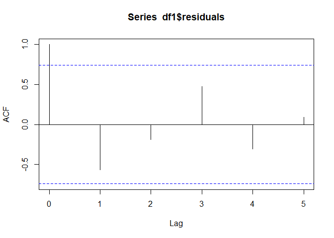

Demand Forecast using Prophet library
================
Joshua Edefo
2024-08-02

Install and Load required libraries

``` r
library(readxl) 
library(dplyr)
library(tidyverse)
```

    ## Warning: package 'tidyverse' was built under R version 4.3.2

    ## Warning: package 'ggplot2' was built under R version 4.3.2

    ## Warning: package 'forcats' was built under R version 4.3.2

    ## Warning: package 'lubridate' was built under R version 4.3.3

``` r
library(writexl)
```

    ## Warning: package 'writexl' was built under R version 4.3.2

``` r
library(prophet)
```

    ## Warning: package 'prophet' was built under R version 4.3.3

Import the dataset, cheking and preparing the data for the model

``` r
data <- read_excel("C:/Users/joe62/OneDrive - Aberystwyth University/Apps/Desktop/GP Prescribing/Wales/Data_for_simulation.xlsx")
# pipe dataset into dataframe
df <- as.data.frame(data)
# inspect variables
str(data)
```

    ## tibble [7 × 2] (S3: tbl_df/tbl/data.frame)
    ##  $ date  : POSIXct[1:7], format: "2024-06-04" "2024-06-05" ...
    ##  $ demand: num [1:7] 37 38 38 40 42 43 45

``` r
head (data)
```

    ## # A tibble: 6 × 2
    ##   date                demand
    ##   <dttm>               <dbl>
    ## 1 2024-06-04 00:00:00     37
    ## 2 2024-06-05 00:00:00     38
    ## 3 2024-06-06 00:00:00     38
    ## 4 2024-06-07 00:00:00     40
    ## 5 2024-06-08 00:00:00     42
    ## 6 2024-06-09 00:00:00     43

``` r
# date format
df$date <- ymd(df$date)
df <- df %>% rename(ds = date, y =demand)
```

Create a Prophet model, generatefuter dates and forecast

``` r
model <- prophet(df, daily.seasonality = TRUE)
```

    ## Disabling yearly seasonality. Run prophet with yearly.seasonality=TRUE to override this.

    ## Disabling weekly seasonality. Run prophet with weekly.seasonality=TRUE to override this.

    ## n.changepoints greater than number of observations. Using 4

``` r
#Generate Future Dates for Forecasting
future <- make_future_dataframe(model, periods = 2)
#Make Forecast
forecast <- predict(model, future)
View(forecast)
```

Evaluate Residuals and Autocorrelation and plot the forecast

``` r
df1 <- inner_join(forecast, df, by = "ds")
df1$residuals <- df1$y - df1$yhat
# Calculate autocorrelation using acf
acf(df1$residuals, lag.max = 5)
```

<!-- -->

``` r
# Plot the forecast
dyplot.prophet(model, forecast, xlab = "Demand",  ylab = "Date", main = "Demand Forecast")
```

    ## Warning: `select_()` was deprecated in dplyr 0.7.0.
    ## ℹ Please use `select()` instead.
    ## ℹ The deprecated feature was likely used in the prophet package.
    ##   Please report the issue at <https://github.com/facebook/prophet/issues>.
    ## This warning is displayed once every 8 hours.
    ## Call `lifecycle::last_lifecycle_warnings()` to see where this warning was
    ## generated.

<div class="dygraphs html-widget html-fill-item-overflow-hidden html-fill-item" id="htmlwidget-d6b5cccd2198251b10fc" style="width:672px;height:480px;"></div>
<script type="application/json" data-for="htmlwidget-d6b5cccd2198251b10fc">{"x":{"attrs":{"title":"Demand Forecast","xlabel":"Demand","ylabel":"Date","labels":["day","Actual","Predicted"],"legend":"auto","retainDateWindow":false,"axes":{"x":{"pixelsPerLabel":60}},"colors":["black","blue"],"series":{"Actual":{"axis":"y","drawPoints":true,"strokeWidth":0},"Predicted":{"axis":"y"}},"customBars":true,"showRangeSelector":true,"rangeSelectorHeight":40,"rangeSelectorPlotFillColor":" #A7B1C4","rangeSelectorPlotStrokeColor":"#808FAB","interactionModel":"Dygraph.Interaction.defaultModel"},"scale":"daily","annotations":[],"shadings":[],"events":[],"format":"date","data":[["2024-06-04T00:00:00.000Z","2024-06-05T00:00:00.000Z","2024-06-06T00:00:00.000Z","2024-06-07T00:00:00.000Z","2024-06-08T00:00:00.000Z","2024-06-09T00:00:00.000Z","2024-06-10T00:00:00.000Z","2024-06-11T00:00:00.000Z","2024-06-12T00:00:00.000Z"],[[37,37,37],[38,38,38],[38,38,38],[40,40,40],[42,42,42],[43,43,43],[45,45,45],[null,null,null],[null,null,null]],[[36.73342318667119,37.06354224240573,37.38921053528519],[37.39031743075566,37.71454680048002,38.02272789010445],[38.0488775254656,38.36555135078986,38.67780915014684],[39.68850098404442,40.00518448519107,40.31756168297858],[41.33350894806872,41.64481761982245,41.95489322832806],[42.9604730859986,43.28437110567997,43.61357863063206],[44.61387799119775,44.92392459153751,45.22004934317511],[46.22531020895814,46.56347807739504,46.9526038013364],[47.67786730063783,48.20303156325256,48.77388067768641]]],"plugins":{"Unzoom":"{}"}},"evals":["attrs.interactionModel","plugins.Unzoom"],"jsHooks":[]}</script>

session information

``` r
sessionInfo()
```

    ## R version 4.3.1 (2023-06-16 ucrt)
    ## Platform: x86_64-w64-mingw32/x64 (64-bit)
    ## Running under: Windows 11 x64 (build 22631)
    ## 
    ## Matrix products: default
    ## 
    ## 
    ## locale:
    ## [1] LC_COLLATE=English_United Kingdom.utf8 
    ## [2] LC_CTYPE=English_United Kingdom.utf8   
    ## [3] LC_MONETARY=English_United Kingdom.utf8
    ## [4] LC_NUMERIC=C                           
    ## [5] LC_TIME=English_United Kingdom.utf8    
    ## 
    ## time zone: Europe/London
    ## tzcode source: internal
    ## 
    ## attached base packages:
    ## [1] stats     graphics  grDevices utils     datasets  methods   base     
    ## 
    ## other attached packages:
    ##  [1] prophet_1.0     rlang_1.1.1     Rcpp_1.0.11     writexl_1.4.2  
    ##  [5] lubridate_1.9.3 forcats_1.0.0   stringr_1.5.0   purrr_1.0.2    
    ##  [9] readr_2.1.4     tidyr_1.3.0     tibble_3.2.1    ggplot2_3.4.4  
    ## [13] tidyverse_2.0.0 dplyr_1.1.3     readxl_1.4.3   
    ## 
    ## loaded via a namespace (and not attached):
    ##  [1] gtable_0.3.4       xfun_0.40          QuickJSR_1.1.3     htmlwidgets_1.6.2 
    ##  [5] inline_0.3.19      lattice_0.21-8     tzdb_0.4.0         vctrs_0.6.3       
    ##  [9] tools_4.3.1        generics_0.1.3     stats4_4.3.1       parallel_4.3.1    
    ## [13] fansi_1.0.4        xts_0.13.2         pkgconfig_2.0.3    RcppParallel_5.1.7
    ## [17] lifecycle_1.0.3    compiler_4.3.1     munsell_0.5.0      codetools_0.2-19  
    ## [21] htmltools_0.5.6    yaml_2.3.7         pillar_1.9.0       crayon_1.5.2      
    ## [25] ellipsis_0.3.2     StanHeaders_2.32.6 rstan_2.32.6       tidyselect_1.2.0  
    ## [29] digest_0.6.33      stringi_1.7.12     fastmap_1.1.1      grid_4.3.1        
    ## [33] colorspace_2.1-0   cli_3.6.1          magrittr_2.0.3     loo_2.7.0         
    ## [37] pkgbuild_1.4.3     utf8_1.2.3         withr_2.5.0        scales_1.3.0      
    ## [41] timechange_0.2.0   rmarkdown_2.25     extraDistr_1.10.0  matrixStats_1.3.0 
    ## [45] gridExtra_2.3      cellranger_1.1.0   zoo_1.8-12         hms_1.1.3         
    ## [49] evaluate_0.21      knitr_1.44         glue_1.6.2         dygraphs_1.1.1.6  
    ## [53] rstudioapi_0.15.0  jsonlite_1.8.7     R6_2.5.1

\`\`\`
